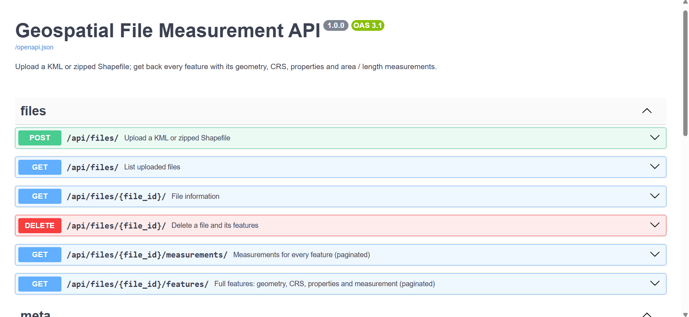
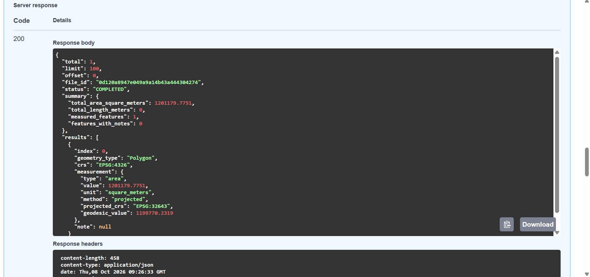

# Geospatial File Measurement API

A FastAPI backend that accepts a **KML** file or a **zipped Shapefile**, extracts every
feature (ID, geometry type, geometry, CRS, properties) and returns **area** (polygons) and
**length** (lines). Measurements are never taken in degrees: geographic coordinates
are reprojected to a metric CRS first.

- **Stack:** FastAPI, GeoPandas (+ pyogrio / GDAL), Shapely, pyproj, SQLAlchemy (SQLite)
- **Interactive docs:** `http://localhost:8000/docs` (Swagger UI, generated automatically)

---

## Demo




---

## Setup

Requires Python 3.10+. The GeoPandas / pyogrio / pyproj wheels bundle GDAL and PROJ, so no
system GDAL install is needed.

```bash
git clone https://github.com/hdDARSHAN007/Geospatial-File-Measurement-.git
cd Geospatial-File-Measurement-

python -m venv .venv
source .venv/bin/activate          # Windows PowerShell: .venv\Scripts\Activate.ps1
pip install -r requirements.txt

uvicorn app.main:app --reload      # http://localhost:8000
```

Run the tests:

```bash
pytest -v
```

Optional: generate sample shapefile zips (a hand-written `sample_data/survey.kml` is already included):

```bash
python scripts/make_sample_data.py
```

### Configuration (environment variables)

| Variable          | Default              | Meaning                                  |
|-------------------|----------------------|------------------------------------------|
| `DATABASE_URL`    | `sqlite:///./geo.db` | Any SQLAlchemy URL                       |
| `UPLOAD_DIR`      | `./uploads`          | Where uploaded files are stored          |
| `MAX_UPLOAD_MB`   | `50`                 | Max upload size                          |
| `MAX_UNZIPPED_MB` | `500`                | Max total size of an extracted zip       |
| `MAX_ZIP_ENTRIES` | `200`                | Max files inside a zip                   |

---

## API

| Method | Path                              | Description                                         |
|--------|-----------------------------------|-----------------------------------------------------|
| POST   | `/api/files/`                     | Upload and process a `.kml` or `.zip` (Shapefile)   |
| GET    | `/api/files/`                     | List uploaded files                                 |
| GET    | `/api/files/{id}/`                | File information                                    |
| GET    | `/api/files/{id}/measurements/`   | Measurements per feature + totals (paginated)       |
| GET    | `/api/files/{id}/features/`       | Full features: geometry, CRS, properties, measurement (paginated) |
| DELETE | `/api/files/{id}/`                | Delete a file and its features                      |
| GET    | `/health`                         | Liveness check                                      |

Pagination: `?limit=100&offset=0` (limit max 1000).

> On Windows PowerShell use `curl.exe` instead of `curl`.

### Upload

```bash
curl -X POST http://localhost:8000/api/files/ -F "file=@sample_data/survey.kml"
```

```json
{
  "id": "4535e42512044b1e8248e3ad2897fd24",
  "filename": "survey.kml",
  "file_type": "kml",
  "feature_count": 5,
  "crs": "EPSG:4326",
  "status": "COMPLETED",
  "error": null,
  "created_at": "2026-10-08T08:42:06.017446Z"
}
```

Status codes: `201` ok · `400` wrong extension / empty file · `413` too large ·
`422` file could not be processed (the body contains the reason and a `file_id`; the failed
upload is still recorded with status `FAILED`).

```json
{ "detail": { "message": "Shapefile is missing required component(s): .dbf", "file_id": "..." } }
```

### File information

```bash
curl http://localhost:8000/api/files/4535e42512044b1e8248e3ad2897fd24/
```

### Measurements

```bash
curl "http://localhost:8000/api/files/4535e42512044b1e8248e3ad2897fd24/measurements/"
```

Real output for `sample_data/survey.kml`:

```json
{
  "total": 5, "limit": 100, "offset": 0,
  "status": "COMPLETED",
  "summary": {
    "total_area_square_meters": 537181.6248,
    "total_length_meters": 1930.3004,
    "measured_features": 3,
    "features_with_notes": 1
  },
  "results": [
    { "index": 0, "geometry_type": "Point", "measurement": null, "note": null },
    { "index": 1, "geometry_type": "LineString",
      "measurement": { "type": "length", "value": 1930.3004, "unit": "meters",
                       "method": "projected", "projected_crs": "EPSG:32643",
                       "geodesic_value": 1929.1698 } },
    { "index": 2, "geometry_type": "Polygon",
      "measurement": { "type": "area", "value": 248760.0301, "unit": "square_meters",
                       "method": "projected", "projected_crs": "EPSG:32643",
                       "geodesic_value": 248472.4064 } },
    { "index": 3, "geometry_type": "Polygon",
      "measurement": { "type": "area", "value": 288421.5947, "unit": "square_meters",
                       "method": "projected", "projected_crs": "EPSG:32643",
                       "geodesic_value": 288083.6675 } },
    { "index": 4, "geometry_type": "GeometryCollection", "measurement": null,
      "note": "unsupported geometry type: GeometryCollection" }
  ]
}
```

### Features (geometry + properties)

`GET /api/files/{id}/features/` returns, per feature: `index`, `geometry_type`, `geometry`
(GeoJSON, in the file's original CRS), `crs`, `properties`, `measurement`, `note`.

---

## Architecture

### Application structure

```
app/
  main.py               FastAPI app, lifespan (creates tables), router wiring
  config.py             Settings from environment variables
  db.py                 SQLAlchemy engine / session / get_db dependency
  models.py             FileRecord, FeatureRecord
  schemas.py            Pydantic response models
  api/files.py          HTTP layer: validation, status codes, pagination
  services/
    parser.py           KML / zipped Shapefile -> GeoDataFrame (+ safe unzip)
    crs.py              CRS labels, projected-CRS selection, unit factors
    measurements.py     Area / length for one geometry
    processing.py       Orchestration: parse -> measure -> persist
tests/                  API tests and unit tests
sample_data/            Example input
scripts/                Sample-data generator
```

The HTTP layer contains no geospatial logic, and the services contain no HTTP
concepts, so each can be tested on its own.

### File-processing flow

1. `POST /api/files/` checks the extension (`.kml` / `.zip`) and streams the body to
   `uploads/<id>/original.<ext>`, enforcing the size limit while reading.
2. A `FileRecord` is stored with status `PROCESSING`.
3. **Zip:** extracted into `uploads/<id>/extracted/` with a *zip-slip* check (every member must
   resolve inside the target folder), an entry-count limit and a total-size limit (zip-bomb
   guard). macOS `__MACOSX` junk is ignored. Exactly one `.shp` must exist, with its `.shx`
   and `.dbf`. It is read with GeoPandas (pyogrio).
   **KML:** every layer (KML folder) is read and concatenated.
4. Each feature becomes a `FeatureRecord`: index, geometry type, GeoJSON geometry, CRS,
   properties (NaN/NumPy/date values converted to JSON-safe values) and its measurement.
5. The file is marked `COMPLETED` (with `feature_count` and `crs`), or `FAILED` with a message.
   Expected problems (bad zip, missing files, unreadable data, unknown CRS) become `422`;
   anything unexpected is logged and reported as a generic failure.

### Measurement flow

For each geometry (`services/measurements.py`):

| Geometry                             | Result                                                    |
|--------------------------------------|-----------------------------------------------------------|
| `Polygon`, `MultiPolygon`            | area in `square_meters` (holes are subtracted)            |
| `LineString`, `MultiLineString`      | length in `meters`                                        |
| `Point`, `MultiPoint`                | no measurement (`measurement: null`)                      |
| empty / `GeometryCollection` / other | `measurement: null` + explanatory `note`                  |
| invalid polygon (e.g. bow-tie)       | measured, with a `note` that the result may be inaccurate |

Measurement is wrapped so that one bad feature can never fail the whole upload.

### CRS handling

- **KML** is always WGS 84 (EPSG:4326) by specification.
- **Shapefile** CRS comes from the `.prj`. If there is no `.prj`, the file is accepted *only*
  if every coordinate lies within lon/lat bounds (then EPSG:4326 is assumed); otherwise it is
  rejected with a clear message, because guessing a projected CRS would silently give wrong results.
- **Geographic CRS (e.g. EPSG:4326):** never measured in degrees. Each geometry is reprojected
  to the **UTM zone of its centroid** (EPSG:326xx north / 327xx south), or to a polar
  stereographic CRS beyond 84°N / 80°S, and area / length are measured there.
  The response states which CRS was used (`projected_crs`).
- **Projected CRS:** measured directly in the file's CRS, converted to metres using the CRS axis
  unit (so a feet-based CRS is handled correctly).
- A **geodesic** value (WGS 84 ellipsoid, via `pyproj.Geod`) is returned next to every
  geographic measurement as `geodesic_value` for cross-checking.

---

## Design decisions

**FastAPI vs Django/DRF.** The task is a small, file-in / JSON-out service. FastAPI gives
validation, typed responses and Swagger docs with very little setup. Django's value
(admin, ORM migrations, auth) is not needed here, and GeoDjango adds a heavy GDAL/GEOS
system dependency.

**Projected (UTM) vs geodesic measurement.** UTM is accurate to roughly 0.1% inside a zone and is
easy to explain and verify (the "transform to a projected CRS" approach). Geodesic calculation is
accurate everywhere and has no zone problems, but is less familiar to reviewers. I used UTM as the
primary result and return the geodesic number alongside it, which makes the difference visible; the
tests assert that they agree within the expected ~0.1-0.2%. In the sample file, Plot 1 measures
248,760 m² (UTM) vs 248,472 m² (geodesic), about 0.1% apart, because the plots sit ~2.6° east of the
zone's central meridian where UTM stretches slightly.
*Alternatives considered:* a single equal-area CRS (e.g. a world equal-area projection) is good for
area but distorts length; per-file instead of per-feature zone selection is cheaper but wrong for
files that span several zones, so the zone is chosen per feature.

**Per-feature zone selection.** Chosen from the centroid. Known limitations: a single
feature spanning several UTM zones, or crossing the antimeridian, is measured in its
centroid's zone (small error); the Norway/Svalbard zone exceptions are not applied.

**SQLite + SQLAlchemy.** Zero setup for a reviewer, yet a real relational model; switching to
PostgreSQL is a one-line `DATABASE_URL` change. Geometries are stored as GeoJSON in a JSON column and
measurements are also stored in plain `area_m2` / `length_m` columns so totals are computed by
SQL aggregates rather than in Python. *Alternative:* PostGIS (better for spatial queries, but not
needed for this task).

**Synchronous processing.** Parsing happens inside the upload request, so the response already
contains the final status. This is simple and fine for files up to the size limit; the `status`
field and the separate GET endpoints already match an asynchronous design (see Future scope).

**Pagination.** Large files can contain tens of thousands of features, so the list endpoints take
`limit` / `offset`; the measurement summary always covers the whole file.

**Failed uploads are recorded.** A rejected file still gets an ID and a `FAILED` record with the
error message, so a client can look the reason up later.

---

## Learnings

- Latitude/longitude are angles: area computed on raw EPSG:4326 coordinates is meaningless
  (square degrees), so the CRS must be handled before any measurement.
- A Shapefile is several files; real uploads are often incomplete (missing `.dbf`/`.prj`), so
  validation and a clear policy for a missing CRS matter as much as the maths.
- Zip uploads are an attack surface (zip-slip, zip bombs) and need explicit guards.
- KML is looser than it looks: folders become separate layers, features can be mixed
  geometry types, and many columns are empty.
- No single projection is correct everywhere; being explicit about the method and CRS used in
  each result keeps the numbers honest.
- Testing with geometry defined in UTM (a 1 km square = exactly 1,000,000 m²) makes the
  expected values exact.

## Future scope

- **Background processing** (Celery/RQ or FastAPI background tasks) with `PROCESSING` polling or webhooks, for large files.
- **PostgreSQL + PostGIS** for spatial queries (within, intersects, bbox filters) and spatial indexes.
- More formats: GeoJSON, KMZ, GeoPackage, and a multi-shapefile zip.
- Authentication, per-user files and rate limiting; object storage (S3) instead of local disk.
- Optional `?method=geodesic` selection and a requested target CRS.
- Perimeter and 3D (Z-aware) length; filtering by geometry type; GeoJSON export of measured features.
- Handling of antimeridian-crossing and multi-zone features by splitting geometries.
- Docker image, CI (GitHub Actions running `pytest`), and structured logging / metrics.